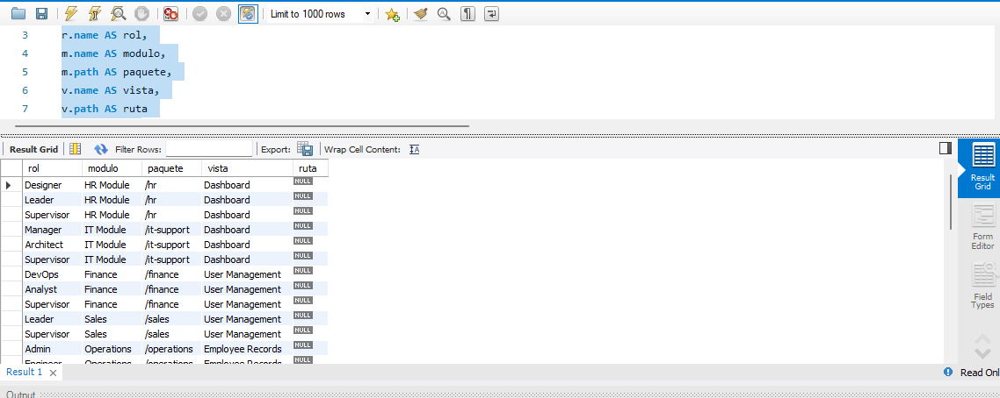
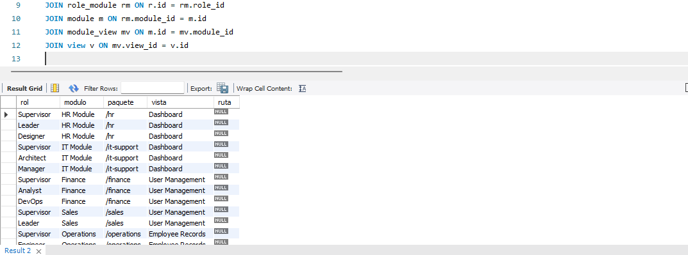

# base_datos_c3_q2

## Consulta SQL y Captura de Resultado

```sql
    use db_security;
SELECT 
r.name AS rol, 
m.name AS modulo, 
m.path AS paquete, 
v.name AS vista, 
v.path AS ruta 
FROM role r 
JOIN role_module rm ON r.id = rm.role_id 
JOIN module m ON rm.module_id = m.id 
JOIN module_view mv ON m.id = mv.module_id 
JOIN view v ON mv.view_id = v.id
 WHERE r.state = 1 -- Solo roles activos ORDER BY r.name, m.name;

```
## Imagen de resultado 

## Imagen de sin resultado filtrado
